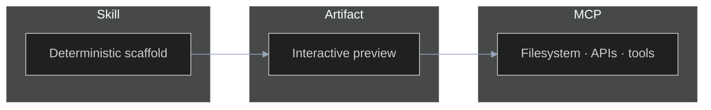

<p align="center">
  
</p>

<p align="center"><sub>Banner + strips + mascot use SVG <strong>SMIL</strong> — animates in GitHub README previews.</sub></p>

<p align="center">
  
</p>

<p align="center"><sub>Playground sprite · <a href="playground/monkey-pasta.svg"><code>playground/monkey-pasta.svg</code></a> · single SVG “sheet,” motion via <code>&lt;animate&gt;</code> / <code>&lt;animateTransform&gt;</code></sub></p>

<p align="center">
  
  
  
  
  
</p>

<p align="center"><strong>Scaffolding + reference library + runnable MCP servers</strong> for <strong>art, animation, UX/UI, graphics, games, audio, dataviz, shaders, export, and agentic asset pipelines</strong> — built around Claude <strong>Artifacts</strong>, <strong>Skills</strong>, <strong>MCP</strong>, and the <strong>API</strong>.</p>

<p align="center">Mount into a <a href="https://support.claude.com/en/articles/9517075-what-are-projects">Claude Project</a> so every thread shares the same facts, guardrails, and starters.</p>

<p align="center">
  <a href="#how-the-pieces-stack">Stack</a>
  &nbsp;·&nbsp; <a href="#whats-in-the-box">Inventory</a>
  &nbsp;·&nbsp; <a href="#cold-start-reading">Reading order</a>
  &nbsp;·&nbsp; <a href="#quick-start">Recipes</a>
  &nbsp;·&nbsp; <a href="#install">Install</a>
  &nbsp;·&nbsp; <a href="#host-layout--child-repos">Child repos</a>
</p>

---

> **Snapshot:** May **2026** — Opus **4.7**, Sonnet **4.6**, Haiku **4.5**. Anthropic rotates IDs without fanfare → **[`knowledge/99-caveats.md`](knowledge/99-caveats.md)** before freezing versions.

---

## At a glance

| You pull from… | You get |
|----------------|---------|
| **[`knowledge/`](knowledge/)** | Routed reference docs (`01`–`17`, `99`) — upload into the Project KB |
| **[`skills/`](skills/)** | **12** `SKILL.md` agents (games, motion, shaders, UI, decks, diagrams, …) |
| **[`artifacts/`](artifacts/)** | **27** sandbox-correct HTML / JSX starters |
| **[`prompts/`](prompts/)** | Copy-paste scaffolds — catalog **[`prompts/README.md`](prompts/README.md)** |
| **[`recipes/`](recipes/)** | End-to-end narratives — index **[`recipes/README.md`](recipes/README.md)** |
| **[`mcp/servers/`](mcp/servers/)** | **3** TypeScript MCP servers + **[`mcp/configs/creative-stack.mcp.json`](mcp/configs/creative-stack.mcp.json)** |

---

## How the pieces stack

<p align="center">
  
</p>



**Defaults** (full routing in [`CLAUDE.md`](CLAUDE.md)): animate **`transform` / `opacity` / `filter` only** · **`oklch()`** · Artifacts → **`window.storage`**, fetch **`api.anthropic.com/v1/messages`** only · Three.js **r128** in sandbox · ship as **Skill → Artifact → MCP**.

---

## Cold-start reading

Priority adapted from [`knowledge/00-index.md`](knowledge/00-index.md):

1. **[`03-artifacts.md`](knowledge/03-artifacts.md)** — sandbox violations are expensive.
2. **[`01-claude-ecosystem.md`](knowledge/01-claude-ecosystem.md)** — models & API shapes.
3. **Domain file** for today’s task (`04` animation … `16` hooks).
4. **[`14-accessibility-performance.md`](knowledge/14-accessibility-performance.md)** — before calling anything “done”.
5. **[`99-caveats.md`](knowledge/99-caveats.md)** — last stop before hardcoding.

---

## What’s in the box

```
knowledge/     19 Markdown guides — 00-index, 01–17, 99-caveats  → Project knowledge payload
skills/        12 Agent Skills (SKILL.md)
artifacts/     27 single-file starters (HTML + React/JSX)
prompts/       13 prompt scaffolds + README
recipes/       6 workflow narratives + README
mcp/servers/   3 TypeScript MCP servers + drop-in config
playground/    optional Vite + React harness (off-sandbox iteration)
plugins/       JUCE pairs for native audio — companions to select artifacts/html
CLAUDE.md      paste into Project Custom Instructions
```

### Knowledge — routing

Open **[`knowledge/00-index.md`](knowledge/00-index.md)** for the full **“if the user asks about…”** table. Abbreviated map:

| # | Files | Covers |
|---|--------|--------|
| 01–03 | [`01`](knowledge/01-claude-ecosystem.md) [`02`](knowledge/02-skills-system.md) [`03`](knowledge/03-artifacts.md) | Ecosystem · Skills · **Artifacts (constraints)** |
| 04–10 | [`04`](knowledge/04-animation.md) [`05`](knowledge/05-graphics-design.md) [`06`](knowledge/06-games.md) [`07`](knowledge/07-audio.md) [`08`](knowledge/08-dataviz.md) [`09`](knowledge/09-prompting.md) [`10`](knowledge/10-workflows.md) | Animation · design · games · audio · dataviz · prompting · pipelines |
| 11–17 | [`11`](knowledge/11-creative-connectors.md) [`12`](knowledge/12-shaders-webgpu.md) [`13`](knowledge/13-asset-pipelines.md) [`14`](knowledge/14-accessibility-performance.md) [`15`](knowledge/15-export-recording.md) [`16`](knowledge/16-hooks-and-retrieval.md) [`17`](knowledge/17-presentations-diagrams.md) | Connectors · shaders · generative media · a11y/perf · export · hooks · decks/diagrams |
| 99 | [`99-caveats.md`](knowledge/99-caveats.md) | Silent rotation |

### Skills — 12 in-repo

[`artifact-game-builder`](skills/artifact-game-builder/SKILL.md) · [`animation-composer`](skills/animation-composer/SKILL.md) · [`presentation-studio`](skills/presentation-studio/SKILL.md) · [`diagram-composer`](skills/diagram-composer/SKILL.md) · [`shader-smith`](skills/shader-smith/SKILL.md) · [`palette-generator`](skills/palette-generator/SKILL.md) · [`sprite-atlas-builder`](skills/sprite-atlas-builder/SKILL.md) · [`ui-design-kit`](skills/ui-design-kit/SKILL.md) · [`procgen-toolkit`](skills/procgen-toolkit/SKILL.md) · [`critique-loop`](skills/critique-loop/SKILL.md) · [`asset-generator`](skills/asset-generator/SKILL.md) · [`viral-news-scanner`](skills/viral-news-scanner/SKILL.md)

### Artifacts

HTML & React starters respect real sandbox rules — catalog **[`artifacts/README.md`](artifacts/README.md)**.

### MCP — three servers

| Server | Role |
|--------|------|
| [`palette-oklch`](mcp/servers/palette-oklch) | WCAG-aware **oklch** palettes |
| [`sprite-packer`](mcp/servers/sprite-packer) | Atlas packing |
| [`asset-router`](mcp/servers/asset-router) | Asset routing / pipeline glue |

Wire clients with **[`mcp/configs/creative-stack.mcp.json`](mcp/configs/creative-stack.mcp.json)**.

---

## Quick start

Assumes [`CLAUDE.md`](CLAUDE.md) + [`knowledge/`](knowledge/) are in a Project and MCPs are built (see [Install](#install)).

| Goal | Recipe | Starter / prompt |
|------|--------|-------------------|
| **Playable game** | [`recipes/game-jam.md`](recipes/game-jam.md) | `artifact-game-builder` + [`game-ecs-starter.jsx`](artifacts/react/game-ecs-starter.jsx) or [`kaplay-top-down.html`](artifacts/html/kaplay-top-down.html) |
| **Animated landing** | [`recipes/animated-landing.md`](recipes/animated-landing.md) | `animation-composer` + [`css-animation-hero.html`](artifacts/html/css-animation-hero.html) or [`bento-grid-landing.jsx`](artifacts/react/bento-grid-landing.jsx) |
| **Data story** | [`recipes/data-story.md`](recipes/data-story.md) | [`prompts/build-dataviz.md`](prompts/build-dataviz.md) + [`dataviz-dashboard.jsx`](artifacts/react/dataviz-dashboard.jsx) |
| **Animated presentation** | [`recipes/animated-presentation.md`](recipes/animated-presentation.md) | `presentation-studio` + [`animated-presentation.html`](artifacts/html/animated-presentation.html) |
| **Diagram / Excalidraw** | [`prompts/build-diagram.md`](prompts/build-diagram.md) | `diagram-composer` + [`scripts/render-diagram.mjs`](scripts/render-diagram.mjs) |
| **Design system** | [`recipes/design-system.md`](recipes/design-system.md) | `ui-design-kit` + palette / UI prompts from [`prompts/README.md`](prompts/README.md) |
| **Agentic pipeline** | [`recipes/agentic-asset-pipeline.md`](recipes/agentic-asset-pipeline.md) | `asset-generator` + **`palette-oklch`** + **`sprite-packer`** (full-stack narrative) |
| **Critique loop** | [`prompts/critique-and-refine.md`](prompts/critique-and-refine.md) | `critique-loop` or [`shader-jam.jsx`](artifacts/react/shader-jam.jsx) |

One-page diagram of how layers connect → **[`docs/diagram.md`](docs/diagram.md)**.

---

## Install

### Claude Project (primary)

1. New Project at [claude.ai](https://claude.ai).
2. Paste **[`CLAUDE.md`](CLAUDE.md)** into **Custom Instructions**.
3. Upload **[all of `knowledge/`](knowledge/)** to the knowledge base.
4. *(Optional)* Attach [`prompts/`](prompts/) or [`recipes/`](recipes/) files you want one-click visible.
5. Start chatting — routing + defaults apply.

### Skills outside Projects

| Surface | How |
|---------|-----|
| **Claude Code** | Copy to `~/.claude/skills/<name>/` or `/plugin add …/skills/<name>` |
| **Claude.ai** (paid) | Skills panel |
| **API** | `/v1/skills` where `code-execution` applies |

### MCP — build all three

```bash
for d in palette-oklch sprite-packer asset-router; do
  ( cd "mcp/servers/$d" && npm install && npm run build )
done
```

Point **`~/.claude.json`** or a project **`.mcp.json`** at **[`mcp/configs/creative-stack.mcp.json`](mcp/configs/creative-stack.mcp.json)**.

### Artifacts locally

Open [`artifacts/html/*.html`](artifacts/html/) in a browser. For React, paste `.jsx` into Claude or import via [`playground/`](playground/).

---

## Host layout — child repos

Top-level folders may be **separate git repos** (their own `.git`). **Not** submodules. Work **inside** the child for that project’s git history — **do not** mix host and child commits. Details → **[`CLAUDE.md`](CLAUDE.md)** (Child repos).

---

## Related work (alongside, not redundant)

- [anthropics/skills](https://github.com/anthropics/skills) — official Skills.
- [greensock/gsap-skills](https://github.com/greensock/gsap-skills) — GSAP.
- [freshtechbro/claudedesignskills](https://github.com/freshtechbro/claudedesignskills) — design / 3D / motion marketplace.
- [HermeticOrmus/claude-code-game-development](https://github.com/HermeticOrmus/claude-code-game-development) — game workflows.
- Lists: [awesome-claude-skills](https://github.com/travisvn/awesome-claude-skills) · [awesome-agent-skills](https://github.com/VoltAgent/awesome-agent-skills).
- Registries: [buildwithclaude.com](https://buildwithclaude.com) · [claudemarketplaces.com](https://claudemarketplaces.com) · [claudepluginhub.com](https://www.claudepluginhub.com).

<details>
<summary><strong>Optional — Claude Code marketplace bulk install</strong></summary>

```sh
claude plugin marketplace add anthropics/skills
claude plugin marketplace add greensock/gsap-skills
claude plugin marketplace add freshtechbro/claudedesignskills
claude plugin marketplace add HermeticOrmus/claude-code-game-development

claude plugin install example-skills@anthropic-agent-skills
claude plugin install claude-api@anthropic-agent-skills
claude plugin install gsap-skills@gsap-skills
claude plugin install game-development@claude-code-workflows

for p in threejs-webgl react-three-fiber pixijs-2d animejs motion-framer \
         lottie-animations rive-interactive gsap-scrolltrigger react-spring-physics \
         babylonjs-engine playcanvas-engine aframe-webxr spline-interactive \
         blender-web-pipeline modern-web-design lightweight-3d-effects \
         scroll-reveal-libraries locomotive-scroll barba-js \
         animated-component-libraries animation-components authoring-motion \
         core-3d-animation extended-3d-scroll web3d-integration-patterns \
         substance-3d-texturing meta-skills; do
  claude plugin install "$p@claude-design-skillstack"
done
```

`claude plugin list --available --json`

</details>

### Why this repo still matters

| Elsewhere | Here |
|-----------|------|
| Claude Code–first | **Project-first** — `knowledge/` is the spine |
| Skills only | Knowledge + prompts + artifacts + MCP + recipes |
| Docs-only MCP | **`npm install && npm run build`** servers in-tree |
| Silent drift | **[`99-caveats.md`](knowledge/99-caveats.md)** names it |

---

<p align="center">
  <a href="LICENSE"></a>
  &nbsp;PRs welcome · new Skills → <a href="knowledge/02-skills-system.md"><code>02-skills-system.md</code></a>
</p>
