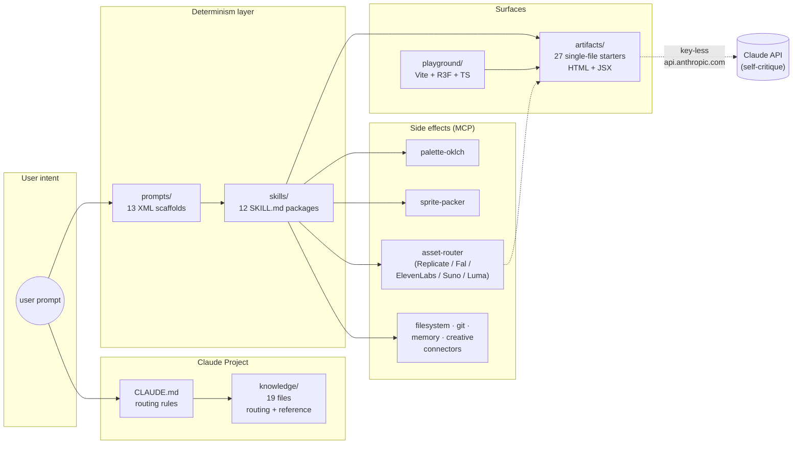

# Pipeline diagram

How the layers of `claude-creative-stack` fit together.

## Layers

1. **Knowledge** is the reference layer — facts, routing tables, version pins. Loaded into a Claude Project once; queried by everything else.
2. **Prompts** are XML-tagged request shapes for common creative tasks. Copy-paste, fill placeholders, send.
3. **Skills** are progressive-disclosure packages (`SKILL.md` + scripts + assets) that own a single capability deterministically.
4. **Artifacts** are runnable single-file starters — the live preview surface. They respect the sandbox; some call back into the Claude API key-less for self-critique (Claudeception).
5. **MCP** is the side-effect layer — file IO, asset generation, color math, sprite packing, plus app connectors (Photoshop, Blender, Ableton, Fusion, SketchUp).
6. **Playground** is the optional Vite host for off-sandbox iteration when an artifact's library whitelist is too tight.

## Flow shapes

- **Read-only** — knowledge file lookup. CLAUDE.md routing → knowledge/NN.
- **Skill-driven** — prompts/scaffold → skill → artifact. Deterministic, no side effects.
- **Agentic asset pipeline** — skill → MCP (asset-router) → MCP (palette-oklch) → MCP (sprite-packer) → artifact (Kaplay). See [`../recipes/agentic-asset-pipeline.md`](../recipes/agentic-asset-pipeline.md).
- **Self-critique loop** — artifact → key-less Claude API call → vision + code in → critique out → user iterates. See [`../artifacts/react/shader-jam.jsx`](../artifacts/react/shader-jam.jsx).

## See also

- [`../README.md`](../README.md) — install + quick start.
- [`../knowledge/00-index.md`](../knowledge/00-index.md) — knowledge routing table.
- [`../knowledge/10-workflows.md`](../knowledge/10-workflows.md) — composing skills + artifacts + MCP in detail.
